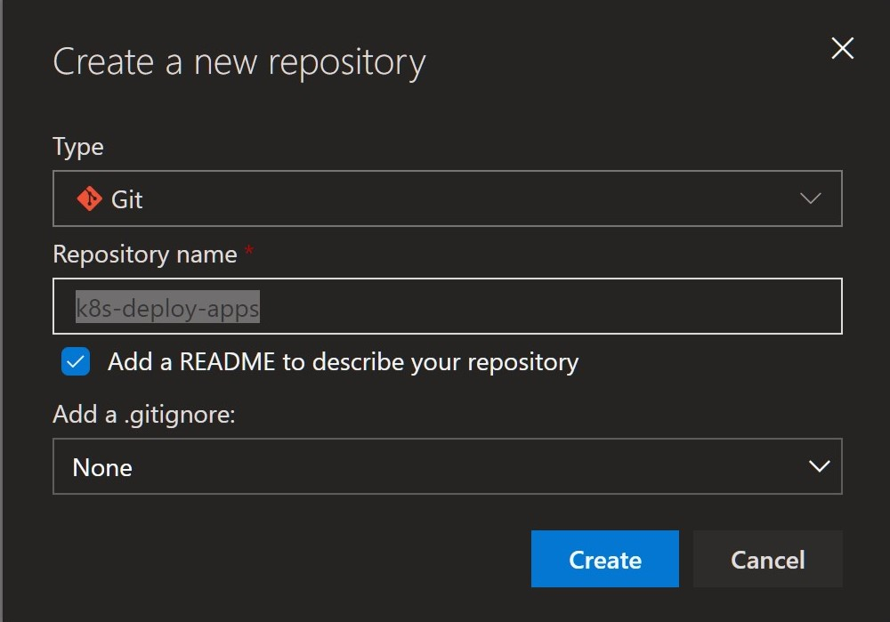
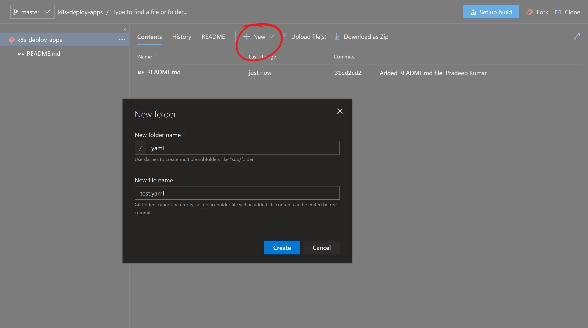
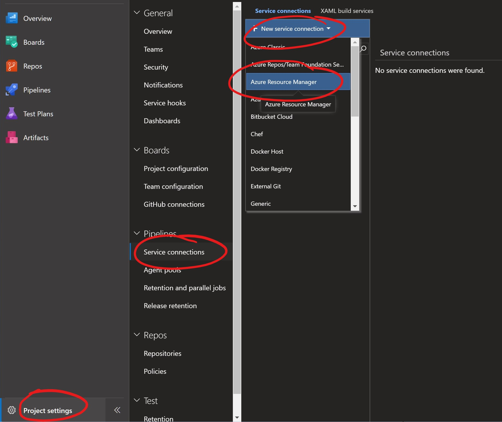
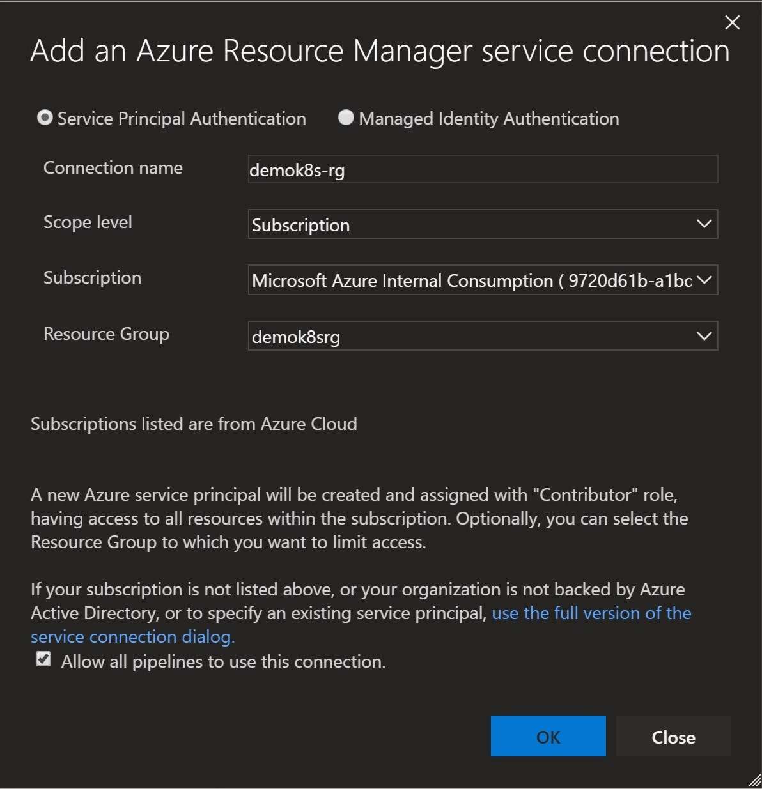
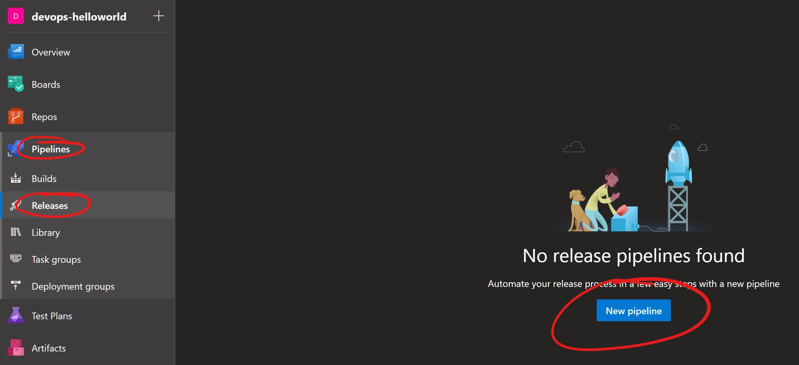
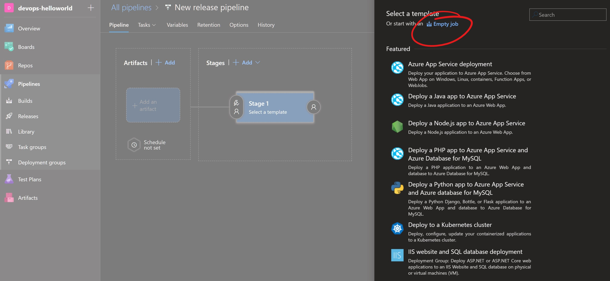
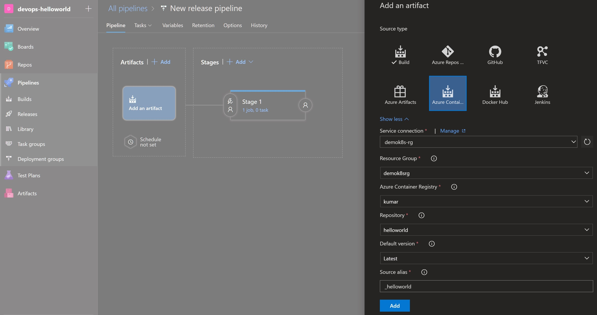
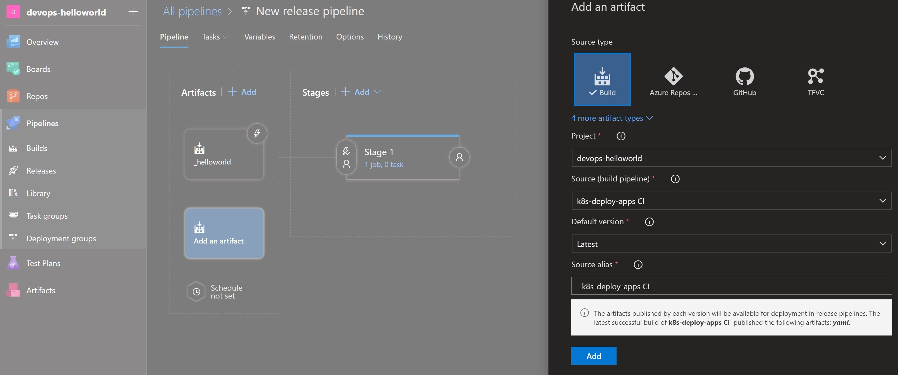

# Continous Deployment with Azure DevOps

- Create a new Azure DevOps Repo, for example kubernetes to hold the the YAML configuration for Kubernetes

- In the new repository, create a folder yaml and add the required YAML, provided with repo you cloned earlier.

- Create build pipeline for the Kubernetes config files

Upload azure-pipelines.yml

- Create a continuous deployment pipeline

*Configure a Service Connection so that Azure DevOps can access resources in your Azure Resource Group for deployment and configuration purposes*

*Create a Release Pipeline, start with an Empty template. Add an Azure Container Registry artifact as a trigger and enable the continuous deployment trigger. Make sure to configure it to point to the Azure Container Registry repository where the build pipeline is pushing the captureorder image*

