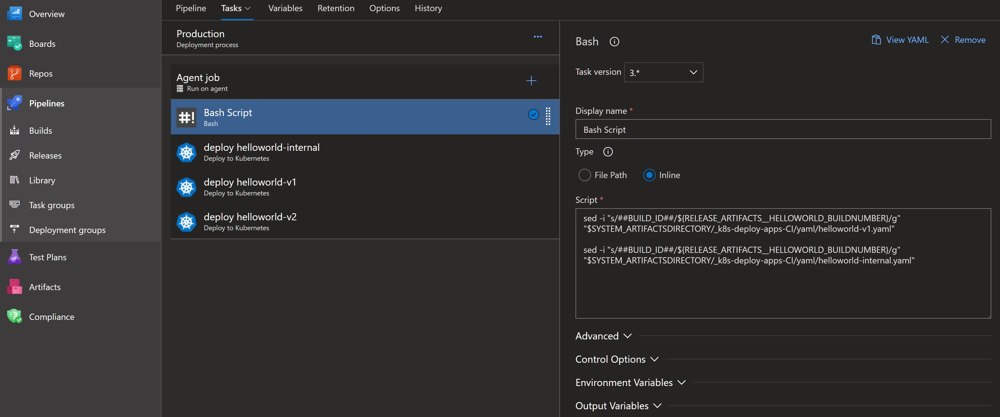

# Continous Deployment with Azure DevOps

- Create a new Azure DevOps Repo, for example k8s-deploy-apps to hold the the YAML configuration for Kubernetes

- In the new repository, create a folder yaml and add all helloworld and aci YAMLs, provided with repo you cloned earlier.
- You must mention file name while creating folder e.g. test.yaml but you can delete it once you upload other YAMLs.

**Create artifacts build pipeline for the Kubernetes config files**

- Upload azure-pipelines.yaml and store it in root directory. Then create a new build pipeline

**Create a continuous deployment pipeline that triggers upon either new container images or new YAML configuration artifacts to deploy the changes to your cluster.**

- Configure a Service Connection so that Azure DevOps can access resources in your Azure Resource Group for deployment and configuration purposes

>Select your resource group

**Create a Release Pipeline**

- Start with an Empty template. Add an Azure Container Registry artifact as a trigger and enable the continuous deployment trigger. Make sure to configure it to point to the Azure Container Registry repository where the build pipeline is pushing the captureorder image*

- Add another Build artifact coming from the k8s-deploy-apps pipeline as a trigger and enable the continuous deployment trigger. This is the trigger for changes in the YAML configuration.

- Add tasks to the default stage. You may rename this stage as dev/ production etc.

 - Make sure the agent pool is Hosted Ubuntu 1604 then add an inline Bash Script task that will do a token replacement to replace ##BUILD_ID## in the helloworld & aci YAMLs file with the actual build being released. Remember that these yamls were published as build artifacts.

 

>You’ll want to get the Docker container tag incoming from the Azure Container Registry trigger to replace the ##BUILD_ID## token. If you named that artifact _helloworld, the build number will be in an environment variable called RELEASE_ARTIFACTS__HELLOWORLD_BUILDNUMBER. Similarly for the other artifact _k8s-deploy-apps, its build ID would be stored in RELEASE_ARTIFACTS__K8s-DEPLOY-APPS-CI_BUILDID. You can use the following inline script that uses the sed tool.

    sed -i "s/##BUILD_ID##/${RELEASE_ARTIFACTS__HELLOWORLD_BUILDNUMBER}/g" "$SYSTEM_ARTIFACTSDIRECTORY/_k8s-deploy-apps-CI/yaml/helloworld-v1.yaml"

- Add a Deploy to Kubernetes task. Configure access to your AKS cluster using the service connection created earlier.

- Scroll down and check Use configuration files and use the following value $(System.DefaultWorkingDirectory)/_azch-captureorder-kubernetes-CI/yaml/captureorder-deployment.yaml or select it from the browse button.

 

  

> **Hint:** Do the same for all other YAMLs. You can right click on the Kubernetes task and clone it.

- Create a manual release and pick the latest build as the source. Verify the release runs and that the captureorder service is deployed