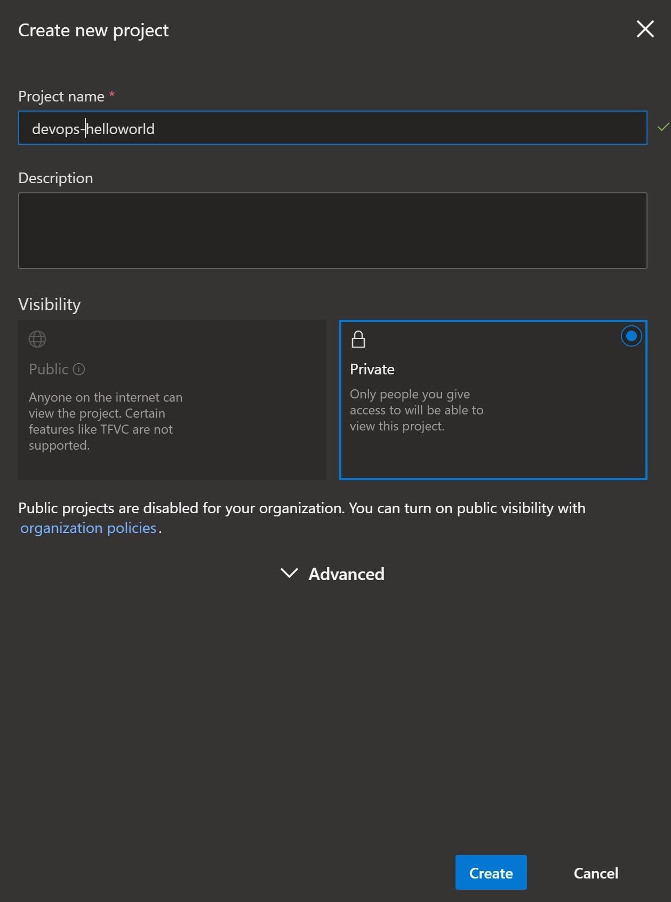
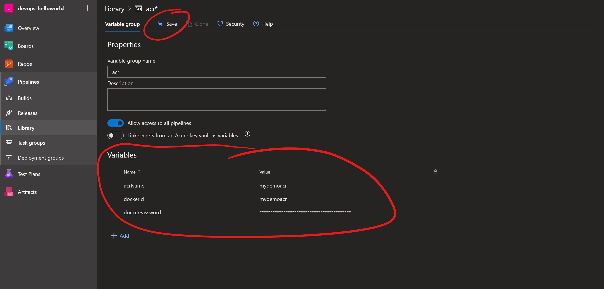
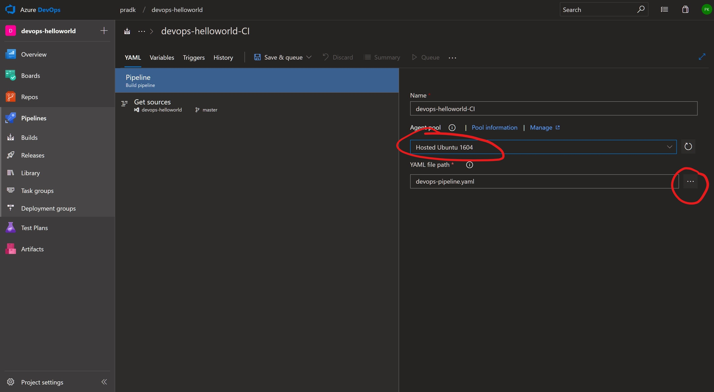
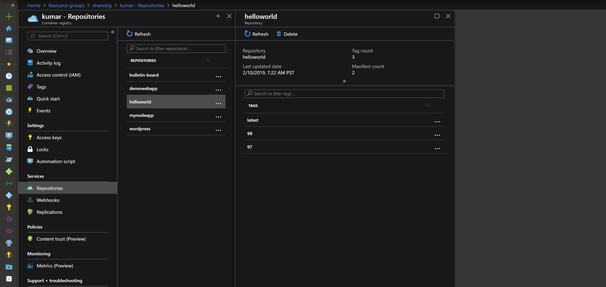

# Continous Integration with Azure DevOps

## Using Azure DevOps to create container images & pushing such images to Azure container registry
- Visit https://dev.azure.com and sign-in with your Azure subscription credentials
- If this is a new Azure DevOps account, a quick wizard will guide you to create a new organization
- Create a new private project, and give it a name.

- Click new repo and import the code for helloworld image from the public GitHub repository located at https://github.com/pkumar26/azure-devops.git

- Define variables for your build pipeline in the web UI: Under Pipelines>Library> Create new variable group
>
        dockerId: The admin user name/Service Principal ID for the Azure Container Registry.
        acrName: The Azure Container Registry name.
        dockerPassword: The admin password/Service Principal password for Azure Container Registry.

- Build pipeline for the application Docker container is included in the repo.

- Choose YAML as the pipeline template

- Browse to and select the devops-pipelines.yml file. You may also change the agent to be Hosted Ubuntu

- Click on variables tab and link already created variable group

- Save & queue will automatically start the build pipeline. Verify that it completes successfully. Once completed, you may verify on azure portal that image is pushed in your repository.

- Modify following line in server.js and commit\
        res.send('Hello World-v2!!\n');\
        to\
        res.send('Hello World!!\n');

- Notice what happens and verify if you've new version of the image in your repository
